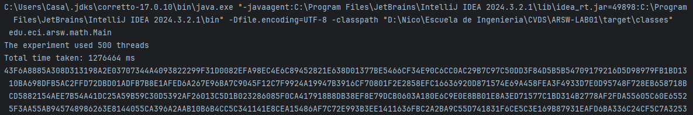

# **Escuela Colombiana de Ingeniería**
## Arquitecturas de Software
## Introducción al paralelismo - hilos

### ***Hecho Por:***
- Juan Pablo Daza Pereira

- Nicolas Bernal Fuquene

## **Parte I Hilos Java**

1. De acuerdo con lo revisado en las lecturas, complete las clases CountThread, para que las mismas definan el ciclo de vida de un hilo que imprima por pantalla los números entre A y B.

2. Complete el método __main__ de la clase CountMainThreads para que:
	- Cree 3 hilos de tipo CountThread, asignándole al primero el intervalo [0..99], al segundo [99..199], y al tercero [200..299].
   
	- Inicie los tres hilos con 'start()'.
   
   	- Ejecute y revise la salida por pantalla.
	  
   - Cambie el inicio con 'start()' por 'run()'. Cómo cambia la salida?, por qué?.
	 

   La salida cambia porque al ejecutar run() la ejecución es de forma secuencial (sin concurrencia), en cambio al ejecutar con start() los hilos se estám ejecutando simultáneamente, lo 
   que genera que los resultados en la salida sean intercalados.

## **Parte II Hilos Java**

La fórmula [BBP](https://en.wikipedia.org/wiki/Bailey%E2%80%93Borwein%E2%80%93Plouffe_formula) (Bailey–Borwein–Plouffe formula) es un algoritmo que permite calcular el enésimo dígito de PI en base 16, con la particularidad de no necesitar calcular nos n-1 dígitos anteriores. Esta característica permite convertir el problema de calcular un número masivo de dígitos de PI (en base 16) a uno [vergonzosamente paralelo](https://en.wikipedia.org/wiki/Embarrassingly_parallel). En este repositorio encontrará la implementación, junto con un conjunto de pruebas. 

Para este ejercicio se quiere calcular, en el menor tiempo posible, y en una sola máquina (aprovechando las características multi-core de la mismas) al menos el primer millón de dígitos de PI (en base 16). Para esto

1. Cree una clase de tipo Thread que represente el ciclo de vida de un hilo que calcule una parte de los dígitos requeridos.
   
2. Haga que la función PiDigits.getDigits() reciba como parámetro adicional un valor N, correspondiente al número de hilos entre los que se va a paralelizar la solución. Haga que dicha función espere hasta que los N hilos terminen de resolver el problema para combinar las respuestas y entonces retornar el resultado. Para esto, revise el método [join](https://docs.oracle.com/javase/tutorial/essential/concurrency/join.html) del API de concurrencia de Java.
   
3. Ajuste las pruebas de JUnit, considerando los casos de usar 1, 2 o 3 hilos (este último para considerar un número impar de hilos!)
   
   
   

**Parte III Evaluación de Desempeño**

A partir de lo anterior, implemente la siguiente secuencia de experimentos para calcular el millon de dígitos (hex) de PI, tomando los tiempos de ejecución de los mismos (asegúrese de hacerlos en la misma máquina):

1. Un solo hilo.

2. Tantos hilos como núcleos de procesamiento (haga que el programa determine esto haciendo uso del [API Runtime](https://docs.oracle.com/javase/7/docs/api/java/lang/Runtime.html)).

3. Tantos hilos como el doble de núcleos de procesamiento.

4. 200 hilos.

5. 500 hilos.

Al iniciar el programa ejecute el monitor jVisualVM, y a medida que corran las pruebas, revise y anote el consumo de CPU y de memoria en cada caso. 

Con lo anterior, y con los tiempos de ejecución dados, haga una gráfica de tiempo de solución vs. número de hilos. Analice y plantee hipótesis con su compañero para las siguientes preguntas (puede tener en cuenta lo reportado por jVisualVM):

Como se puede observar en la grafica, podemos interpretar que mientras mas hilos menor tiempo se requiere para la ejecucion completa del programa, pero no sigue una tendencia lineal, si nos fijamos bien lo que mas llama la atencion en la grafica es que la diferencia entre usar un hilo y usar 24 es MUY grande, en cambio a partir de ahi la diferencia entre mayor es el numero de hilos es cada vez menor, tanto asi que la diferencia de tiempo entre usar 200 y 500 hilos es demasiado pequeña. Esto probablemente se deba a que al usar un solo hilo realmente no se esta aprovechando casi nada las capacidades del computador, de ahi que en la grafica de uso de CPU de un hilo, no muestra casi uso, mientras que en las demas si.

1. Según la [ley de Amdahls](https://www.pugetsystems.com/labs/articles/Estimating-CPU-Performance-using-Amdahls-Law-619/#WhatisAmdahlsLaw?):

	, donde _S(n)_ es el mejoramiento teórico del desempeño, _P_ la fracción paralelizable del algoritmo, y _n_ el número de hilos, a mayor _n_, mayor debería ser dicha mejora. Por qué el mejor desempeño no se logra con los 500 hilos?, cómo se compara este desempeño cuando se usan 200?. 

	**RESPUESTA:** En teoria mientras mayor sea el numero de hilos, mejor deberia ser el desempeño, pero si usamos y nos basamos en la Ley de Amdahls, 
	nos damos cuenta de que la mejora en el desempeño no es exactamente lineal con respecto al numero de hilos utilizados. No importa 
	que tanto aumentemos el numero de hilos va a llegar un momento en donde la mejora en el desempeño comience a ser muy pequeña, esto 
	se puede ver reflejado en la grafica del punto anterior, donde el resultado al usar 200 hilos y 500 hilos es casi el mismo. 

2. Cómo se comporta la solución usando tantos hilos de procesamiento como núcleos comparado con el resultado de usar el doble de éste?.

	**RESPUESTA:** Al usar el doble de tantos hilos como nucleos de procesamiento, el desmempeño es mejor que usando tantos hilos como nucleos de procesamiento, 
	esto podemos verlo reflejado en la grafica y los tiempos tomados del punto anterior, donde podemos observar que le tomo casi la mitad del tiempo 
	en comparacion con el rendimiento obtenido al usar tantos hilos como nuclos de procesamiento. Esto porque al duplicar el numero de hilos el 
	rendimiento va a mejorar notablemente, especialmente porque aun eran pocos hilos, si hubieramos pasado de 200 a 400 hilos no habria habido mucha 
	diferencia.

3. De acuerdo con lo anterior, si para este problema en lugar de 500 hilos en una sola CPU se pudiera usar 1 hilo en cada una de 500 máquinas hipotéticas, la ley de Amdahls se aplicaría mejor?. Si en lugar de esto se usaran c hilos en 500/c máquinas distribuidas (siendo c es el número de núcleos de dichas máquinas), se mejoraría?. Explique su respuesta.
	
	**RESPUESTA:**
   - 1 hilo por 500 maquinas: En teoria, deberia de poder aplicarse mejor la Ley de Amdahls, y por lo tanto deberia haber una mejora en el 
   rendimiendo, puesto que se esta aprovechando al maximo la capacidad de cada una de las maquinas.
   - c hilos en 500/c maquinas: En este caso, hipoteticamente tambien deberia haber una mejora en el rendimiento, porque cada hilo tendria la 
   situacion perfecta para poder aprovechar al maximo las capacidades de su maquina, cada maquina podria usar el numero de hilos mas apropiado 
   para sacar el mejor rendimiento a la par que se hace uso de varias maquinas a la vez.
